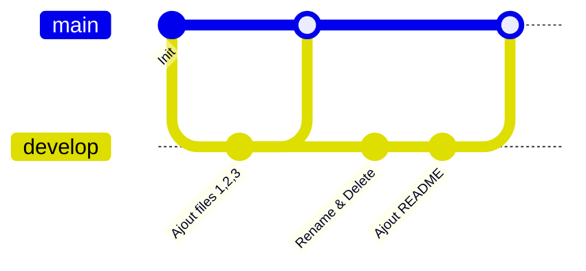

# TP1 CESI

## Description du TP
Ce TP a pour but de s'exercer sur les commandes de base de Git.

### Pré-requis
Avoir un terminal et une connexion internet.

## Installation de Git

Voici comment installer Git sur une distribution Linux :

```bash
sudo apt-get update
sudo apt-get install git-all

# TP DevOps : Introduction à Git

## Description du projet
Ce projet a pour but de s'exercer sur les commandes de base de Git et la gestion des branches (Git Flow).
Il retrace les étapes de création d'un dépôt, de manipulation de fichiers et de fusion de branches.

## Pré-requis
- Un terminal de commande (Git Bash, PowerShell ou Terminal Linux)
- Git installé sur la machine
- Une connexion SSH configurée vers GitHub

---

## Installation de Git

### Linux (Ubuntu / Debian)
```bash
sudo apt-get update
sudo apt-get install git-all
```


## Documentation officielle
Les sources suivantes ont été utilisées pour la réalisation de ce TP :
- Documentation officielle Git
- Guide de connexion SSH GitHub
- Guide du Markdown

---

## Tableau des commandes réalisées

| Commande | Description |
|--------|------------|
| `git init` | Initialise un nouveau dépôt Git dans le dossier actuel |
| `git checkout -b develop` | Crée une nouvelle branche `develop` et s'y positionne |
| `git add .` | Ajoute tous les fichiers à l'index |
| `git commit -m "msg"` | Enregistre les modifications |
| `git push -u origin [branch]` | Envoie les commits vers le dépôt distant |
| `git merge develop` | Fusionne la branche `develop` dans la branche courante |
| `git mv old new` | Renomme un fichier |

---

## Diagramme du Git Flow


